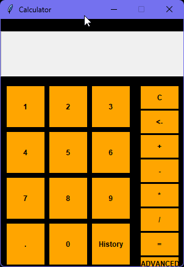
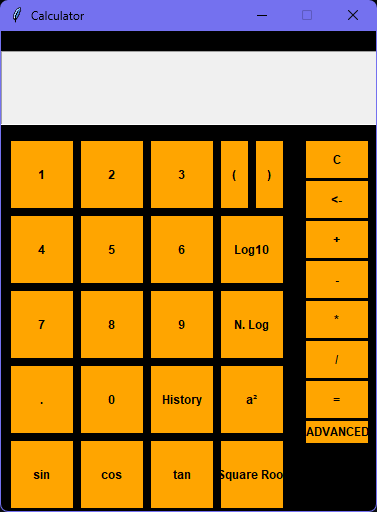
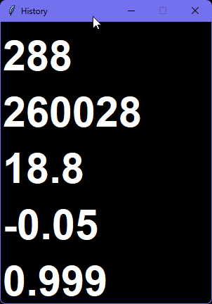

# 🧮 Advanced Calculator (Tkinter GUI)

A Python project built with **Tkinter** for practicing GUI development.  
This calculator supports both **basic** and **advanced** operations, with a history window and a simple resizable interface.  

⚠️ Note: This project is **not fully optimized** — it was made as a **learning exercise** to explore GUI programming in Python.

---

## ✨ Features
- Basic operations: `+`, `-`, `*`, `/`
- Decimal input & backspace support
- Advanced functions:
  - Trigonometry: `sin`, `cos`, `tan`
  - Logarithms: `log`, `log10`
  - Square root, square (`a²`)
- Expression evaluation using Python’s `eval()`
- History window for last 5 results
- Expandable/advanced mode (resizes UI for extra functions)
- Error handling (e.g., invalid input)

---

## 🖥️ Screenshots







---

## 🚀 How to Run
1. Make sure you have **Python 3.x** installed.  
2. Run the script with:
   ```bash
   python calculator.py

## 📖 Learning Goals

This project was created to:

Practice Tkinter GUI layout

Work with event handling (button callbacks)

Explore math functions in Python

Learn how to manage state and history in GUI apps

## 🛠️ Possible Improvements

Better input validation (reduce reliance on eval)

Cleaner UI layout with grid/pack

Save history between sessions

Dark/light mode toggle

Optimized code structure (OOP)

## 📜 License

This project is open source and available under the MIT License.
